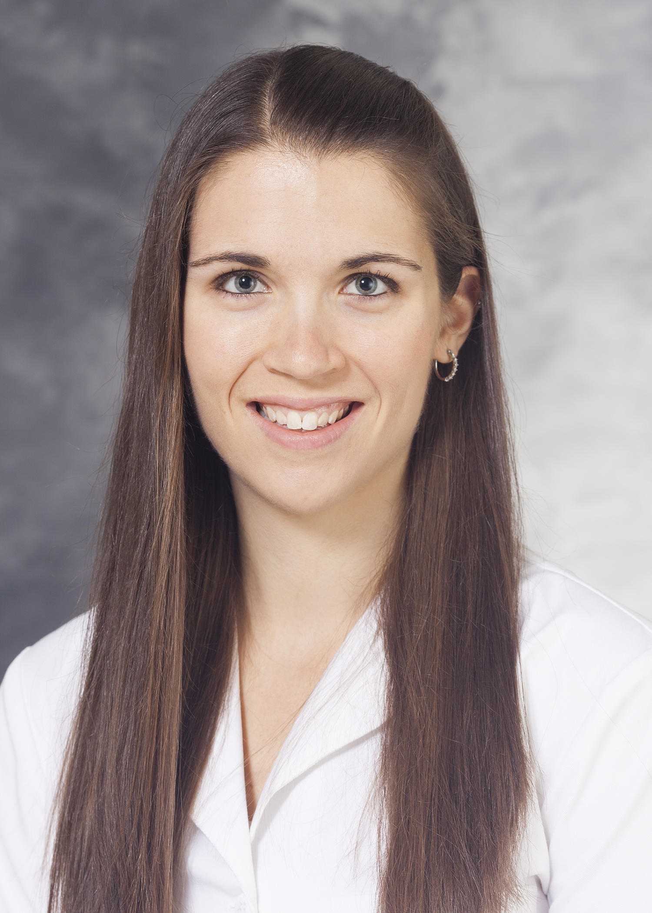
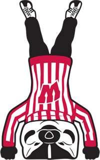
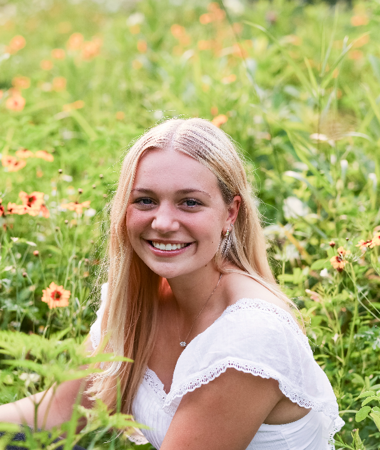

Welcome to the Lang Lab! We have a great group of people working in our group.

### Jessica Lang, PhD

###### Assistant Professor

###### Department of Pathology and Laboratory Medicine

###### Center for Human Genomics and Precision Medicine Faculty Member

###### Center for Genomic Science Innovation Affiliate Faculty Member

Jessica obtained her bachelors (Genetics, 2009) and doctorate (Cancer Biology, 2014) at the University of Wisconsin-Madison. She then completed two postdoctoral fellowships at Arizona State University and The Translational Genomics Research Institute (TGen). Jessica was awarded an NCI K99/R00 in 2019 to focus her studies on the role of super-enhancers in high-grade serous ovarian carcinomas. She joined the University of Wisconsin-Madison faculty in 2021, where she will leverage her experience in translational biology, genomics, and epigenetics.  
In her spare time, Jessica enjoys spending time with her family, cooking, outdoors activities, reading, and game nights.

### Kristin Adams, MS

###### Researcher I

Kristin obtained her bachelors (Human Biology-Health Science Emphasis, 2015) at the University of Wisconsin-Green Bay and her masters (Cell and Molecular Biology, 2017) at University of Wiconsin-La Crosse. Her masters thesis work characterized BRCA1-deficient breast cancer cells with acquired resistance to CHK1 inhibitor therapy. Kristin joined the Lang lab as Research Specialist in 2021 after spending almost 4.5 years as a Research Specialist and Lab Manager within UW's Human Oncology Department.
Outside of work Kristin is an active volunteer with various dog rescue groups and is a part-time assistant trainer with Dog's Best Friend Training in Madison. She enjoys spending her free time with her family at home, and her favorite activity is exploring new hiking spots in the area.

### Jae Rim (Kendra) Wendt, MS

###### Research Specialist
Kendra obtained her bachelors (Microbiology, 2015) and masters (Veterinary Medicine, 2017) at Chungbuk National University in South Korea. For her master's thesis, she studied the potential of engineered stem cells as delivery vehicles for treatment of malignant melanoma. Kendra joined the Lang lab as a Research Specialist in 2022.
Outside of work, Kendra enjoys reading, working out, traveling, and spending time with her family.

### Zhongmou Jin, MS

###### Graduate Student  
Jin is a graduate student from the Cellular and Molecular Biology program. His work focuses on characterizing the functional requirement of super-enhancers in ovarian cancer. 

### Ryan Moreno
###### Graduate Student 
Ryan Moreno is a computer science graduate student at UW-Madison assisting with our computational projects. He obtained his bachelors in computer science from the University of Southern California in 2020. He has worked in a variety of research areas, including quantum computing, natural language processing, and medical prosthetics. Outside of work, Ryan enjoys running, soccer, hockey, and board games.

### Josie Wood

###### Research Intern  
Josie graduated from the University of Wisconsin-Madison in 2023 with her bachelor’s degree in Biology. She joined the Lang lab as a Research Assistant in January of 2022 and has hopes to pursue medical school in the future. In her free time, Josie enjoys cooking, spin classes, volunteering at a local animal shelter, and checking out fun spots in Madison with her friends.

### Sydney Olson

###### Research Assistant  
Sydney is an undergraduate at UW-Madison, majoring in Biology with certificates in Global Health and Leadership. She has been a research assistant at the Lang Lab since January of 2022. Outside of the lab, Sydney enjoys baking, running, and spending time with family and friends.

### Lauren Kersten
Lauren is a double Major in Molecular and Cell Biology and Spanish. She joined the Lang lab in February of 2024. Lauren has aspirations of going to medical school after receiving her bachelor's degrees. In her free time, Lauren enjoys cycling, going on walks with her dog, horseback riding and volunteering at a local therapeutic horseback riding center. 

### Amelia Rancour

###### Research Assistant  
Amelia is an undergraduate majoring in biochemistry at UW-Madison.  She joined the lab in May of 2024 as a research assistant.  Amelia plans to go to graduate school and become a scientific researcher.  In her free time, she likes to play the piano, read, crochet, hang out with friends, and play soccer.

### Kevin Shine George

###### Research Assistant  
Kevin is an undergraduate student at UW-Madison, where he is pursuing dual majors in Computer Science and Data Science. He assists with our computational projects and aspires to attend graduate school in the future. Kevin's area of expertise primarily centers around data wrangling and analytics. Outside of his academic and professional pursuits, he enjoys staying active through badminton, working out, and reading, as well as listening to music and spending time with friends.

# Former Lab Members:
Srihari Gopalan - Research Assistant 

# We're growing our team!  

### Postdocs
We continuously review highly qualified postdoc applicants.
[Please submit CV & cover letter here](mailto:jessica.lang@wisc.edu).

### Affiliated graduate programs
[Cellular & Molecular Pathology](https://cmp.wisc.edu/)  
[Cancer Biology](https://cancerbiology.wisc.edu/)  
[Cellular & Molecular Biology](https://cmb.wisc.edu/)  
