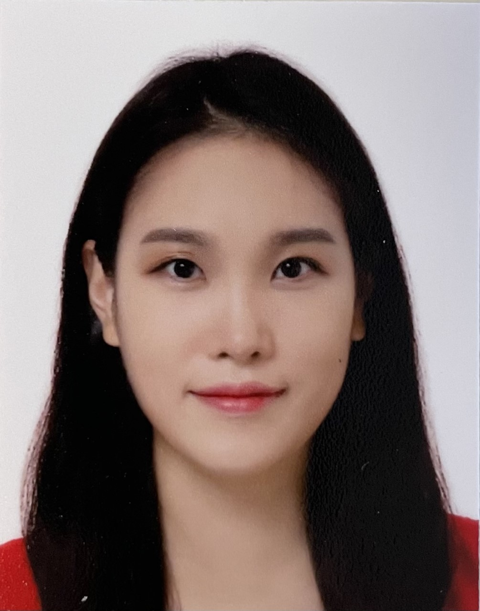

Welcome to the Lang Lab! We have a great group of people working in our group.

### Jessica Lang, PhD

###### Assistant Professor

###### Department of Pathology and Laboratory Medicine

###### Center for Human Genomics and Precision Medicine Faculty Member

###### Center for Genomic Science Innovation Affiliate Faculty Member

Jessica obtained her bachelors (Genetics, 2009) and doctorate (Cancer Biology, 2014) at the University of Wisconsin-Madison. She then completed two postdoctoral fellowships at Arizona State University and The Translational Genomics Research Institute (TGen). Jessica was awarded an NCI K99/R00 in 2019 to focus her studies on the role of super-enhancers in high-grade serous ovarian carcinomas. She joined the University of Wisconsin-Madison faculty in 2021, where she will leverage her experience in translational biology, genomics, and epigenetics.  
In her spare time, Jessica enjoys spending time with her family, cooking, outdoors activities, reading, and game nights.

### Kristin Adams, MS

###### Researcher I

Kristin obtained her bachelors (Human Biology-Health Science Emphasis, 2015) at the University of Wisconsin-Green Bay and her masters (Cell and Molecular Biology, 2017) at University of Wiconsin-La Crosse. Her masters thesis work characterized BRCA1-deficient breast cancer cells with acquired resistance to CHK1 inhibitor therapy. Kristin joined the Lang lab as Research Specialist in 2021 after spending almost 4.5 years as a Research Specialist and Lab Manager within UW's Human Oncology Department.
Outside of work Kristin is an active volunteer with various dog rescue groups and is a part-time assistant trainer with Dog's Best Friend Training in Madison. She enjoys spending her free time with her family at home, and her favorite activity is exploring new hiking spots in the area.

### Jae Rim (Kendra) Wendt, MS

###### Research Specialist

Kendra obtained her bachelors (Microbiology, 2015) and masters (Veterinary Medicine, 2017) at Chungbuk National University in South Korea. For her master's thesis, she studied the potential of engineered stem cells as delivery vehicles for treatment of malignant melanoma. Kendra joined the Lang lab as a Research Specialist in 2022.
Outside of work, Kendra enjoys reading, working out, traveling, and spending time with her family.

### Zhongmou Jin, MS

###### Graduate Student  
Jin is a graduate student in our lab.

### Josie Wood

###### Research Assistant  
Josie is a Junior majoring in Biology.

### Srihari Gopalan

###### Research Assistant  
Srihari is a Sophomore majoring in Biomedical Engineering.

### Sydney Olson

###### Research Assistant  
Sydney is a Freshman majoring in Biology.

### Ryan Moreno

###### Bioinformatics Assistant  
Ryan is a Computer Science graduate student assisting us with our computational projects.

# We're growing our team!  

### Postdocs
We continuously review highly qualified postdoc applicants.
[Please submit CV & cover letter here](mailto:jessica.lang@wisc.edu).

### Affiliated graduate programs
[Cellular & Molecular Pathology](https://cmp.wisc.edu/)  
[Cancer Biology](https://cancerbiology.wisc.edu/)  
[Cellular and Molecular Biology](https://cmb.wisc.edu/)  
